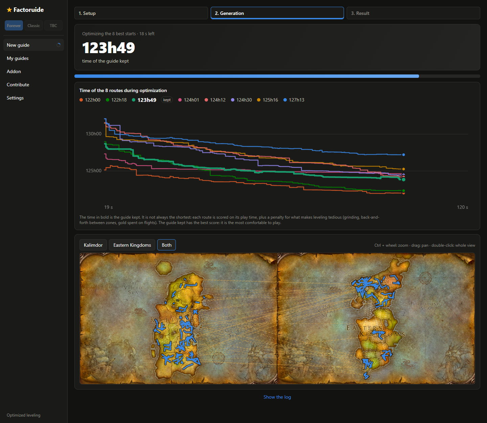

# Factoruide

**A leveling guide built for you**: your character, your professions, your zones, your dungeons
and the way you play. For **WoW Forever**, **Classic Era / Hardcore** and **TBC Anniversary**.

Leveling guides follow one route written for everyone. Factoruide computes yours: it simulates
the whole playthrough with your choices (travel, fights, drops, quest and mob XP, trainers,
professions, and how strong your character gets with its gear and spells) and searches for the
fastest route to your target level, killing the mobs met on the way and grinding only a small
share of each level. The in-game addon then takes you through it step by step.

## An experiment

Factoruide is experimental. A guide comes from a simulation of the game, and the simulation is
not the game: it can produce inconsistencies (a quest you cannot get, a detour that makes no
sense, a time far from yours). When you meet one, please
[open an issue](https://github.com/brouznouf/factoruide/issues) with your guide attached: the
"Share" button of its page saves it as a `.fgguide` file.

It will never replace the guides written by hand, and that is not the goal: their authors play
their route again and again, and a good one will most likely be faster. Factoruide builds a
guide of your own that holds together as a whole and gives your leveling real directions: which
zones to do, the level to reach before moving on from each, and where the XP is.

## A guide that fits you

- **Your character**: race, class and level range: start a guide at level 1, or from your
  character as it is in game. The addon records it at each logout (or at once with
  `/fg profile`): pick it in the list of the new guide and the guide goes on from where it
  stands: its quests done are left out, those in its log are taken again when they help (as if
  never taken) and abandoned as the first step otherwise, from its position, with its
  hearthstone, flight paths, rested XP, gear, spells and professions.
- **Your professions**: two primary professions and the secondary ones, with the skill to have
  at each level from the level you take them (curves from classic guides, editable). They add no
  time to the route: the addon shows whether you are ahead or behind, and their quests are
  suggested as optional steps.
- **Your zones**: click the map to prefer the zones you like and exclude the ones you don't want
  to see again.
- **Your dungeons**: force or exclude each dungeon, do the worthwhile ones in a group, take their
  quests a few levels ahead.
- **Your class quests**: the ones you want to do are kept, even when they are not the fastest.
- **Your play style**: a relaxed, normal or fast pace (time per fight, per loot, per stop), how far
  above your level you take quests and fight mobs, how much grinding you accept, flights or
  walking to save gold, finishing a zone before leaving, staying on one continent, elite quests
  solo or in a group, a crowded server at launch (escorts, events and rare spawns fought over).
- **Your group**: level in a duo or a group with other classes: faster fights, shared XP with the
  group bonus, quest items for everyone, each class's quests and trainers.
- **Your language**: the app and the guide in 10 languages. A guide is computed once and shown in
  the app's language; the addon writes it in the language you choose on its page.

## It adapts as you play

- The addon follows you: it advances by itself (quest accepted, objective done, quest turned in,
  flight, level reached), points the arrow at the next step and compares your real time per level
  with the guide's (`/fg time`).
- Ahead, behind, changed your mind about a profession or a zone? Generate the guide again from your
  character as it is now: it becomes a new version of the guide, with the difference from the previous
  one, and you choose the version installed in the addon.
- The guides learn from the game: the XP and positions the addon records replace the estimates,
  and players can share theirs ("Contribute" page) to improve the quest database for everyone.
- Share a guide with a friend as a `.fgguide` file; they import it in their app.

## Getting started

1. Download the [Windows installer](https://github.com/brouznouf/factoruide/releases/latest) and
   run it. Windows may warn about an unknown publisher the first time (the installer is not
   code-signed). New versions are then offered by the app at startup.
2. **Addon** page: choose your WoW folder, then "Save and install the addon".
3. **New guide**: pick your character, professions, zones, dungeons and play style, then start
   the generation (2 minutes, 6 for a thorough one). The best starting routes are picked first,
   then improved: their times go down live on the chart and the route is drawn on the map. The
   guide kept (in bold) is the best balance between play time and comfort (little grinding, few
   trips between zones), not always the very shortest.
4. **My guides**: tick the version to install in the addon, then `/reload` in game.

## In game: the addon

- Guide: picks the route for your race and class and advances by itself; `/fg guide`, `/fg next`,
  `/fg prev`, `/fg step <n>`, `/fg route [name]`, `/fg waypoint`.
- Size: Ctrl + mouse wheel over a window, or `/fg scale <size>`.
- Helpers: a big arrow towards the current step (green ahead, red behind, distance below),
  targeting macro "FG Cible" (`/fg macro`), quest item button (key binding in the game's
  key bindings, Factoruide section), the step's flight taken automatically, next steps numbered on
  the world map.
- Vendors: sells gray items, repairs, buys food, water and ammunition for your level (disabled by
  default; hold Shift when opening to skip everything).
- Gear and talents: the quest reward the guide planned (the route counts on wearing it), upgrades
  in tooltips and on quest rewards, the recommended talent under the guide. At the class trainer,
  only the spells that matter for leveling are bought.
- Group and safety: party members' progress in the quest tracker, alerts on elite or high-level
  targets and low health, elite objectives flagged in the guide.
- Profile: what the app needs to start a guide from your character (level, XP, quests done and in
  the log, position, hearthstone, flight paths seen on flight maps, professions, gear, spells),
  kept up to date every minute and at logout; `/fg profile` writes it to disk now (the interface
  reloads).
- Collector: records what you see (givers, positions, XP received) for the next guides;
  `/fg status`, `/fg debug`, `/fg reset`.

## How it works

How the optimized route is computed: [ARCHITECTURE.md](ARCHITECTURE.md).

## License

The code is under the MIT license ([LICENSE](LICENSE)). The quest databases (`data/`) are under
GPL-2.0-or-later, the license of the VMaNGOS data they include ([data/LICENSE](data/LICENSE));
their sources and the terms of each are listed in [NOTICE.md](NOTICE.md).
